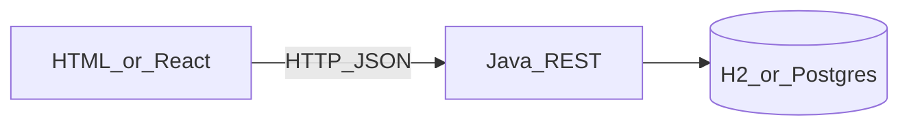

# 41 — REST & Frontend

**Previous:** [40 Spring Boot Intro](40-SpringBootIntro.md)

▶️ Lab: [`projects/05-notes-web`](../../projects/05-notes-web/README.md) · API: [`pkg21spring`](../../pkg21spring/README.md)

---

## Why this chapter?

Backend mastery still needs an **end-to-end** picture: a browser (or React app) calling your Java API with JSON.



---

## JSON contract

Agree on shapes, not frameworks:

```json
{ "id": 1, "title": "Ship lab", "body": "CORS + fetch" }
```

- `Content-Type: application/json`
- Use proper status codes (200, 201, 204, 400, 404)

---

## CORS (browser security)

Browsers block `http://localhost:5500` → `http://localhost:8080` unless the API allows it.

Spring (already in the lab):

```java
@CrossOrigin(origins = "*") // tighten for production
```

Or a `WebMvcConfigurer` adding allowed origins.

---

## Calling from plain JavaScript

```js
const res = await fetch('http://localhost:8080/api/notes')
const notes = await res.json()
```

Full UI: [projects/05-notes-web/frontend](../../projects/05-notes-web/frontend/index.html)

---

## How React would call the same API

```jsx
useEffect(() => {
  fetch('http://localhost:8080/api/notes')
    .then((r) => r.json())
    .then(setNotes)
}, [])
```

Same endpoints — React is optional sugar over `fetch`.

---

## Practice checklist

- [ ] Start `pkg21spring` (`mvn spring-boot:run`)
- [ ] Open the Project 05 HTML UI
- [ ] Create / list / delete notes
- [ ] Explain CORS in one sentence in an interview

**Related →** [15 Spring Boot Interview](../03-interview/15-SpringBoot.md)

**Project →** [05-notes-web](../../projects/05-notes-web/README.md)

**Back to index →** [00-INDEX](00-INDEX.md)
