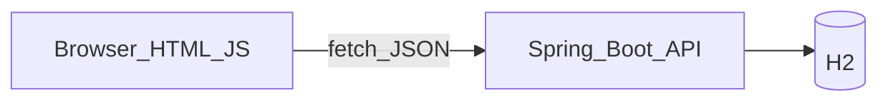

# Project 05 — Notes Web (API + HTML/JS)

**Unlock after:** [Learn ch.41 REST & Frontend](../../docs/02-learn/41-RestAndFrontend.md)



## Goal

Call the Spring Notes API from a plain HTML/CSS/JS page (no Node/React required).

## Done when

- [ ] Page lists notes from `GET /api/notes`
- [ ] Form creates a note via `POST`
- [ ] Delete button works
- [ ] CORS is enabled on the API (`@CrossOrigin` already on controller)

## Run

1. Start API: `cd pkg21spring && mvn spring-boot:run`
2. Open `frontend/index.html` in a browser (or serve the folder with any static server)

If opening as `file://`, some browsers restrict fetch — use:

```bash
cd projects/05-notes-web/frontend
python -m http.server 5500
# open http://localhost:5500
```

## React note

A React app would call the same endpoints with `fetch` / `axios`. The contract is JSON — UI framework is optional.
